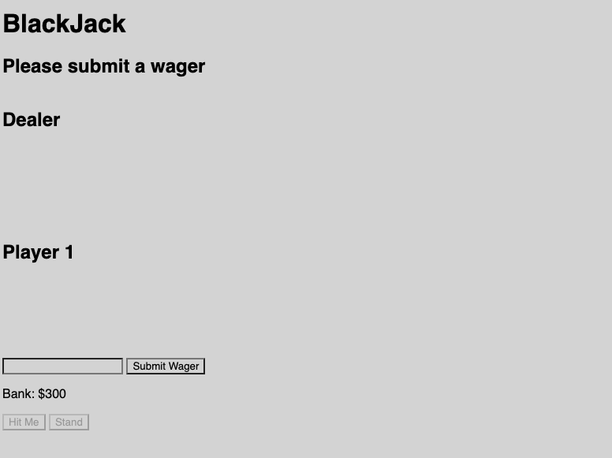
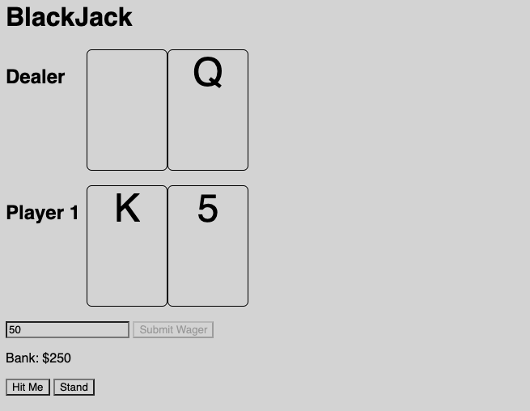

# Blackjack

> "Money won is twice as sweet as money earned.” -Fast Eddie Felson, *The Color of Money*

Blackjack is a betting game played with a 52-card Standard deck; a mainstay at every casino around the world. The object of the game is simple: beat the dealer without your hand value exceeding 21 points. Number cards are evaluated based on their face value. Face cards each have a value of 10. The Ace has either a value of 1 or a value of 11, whichever is more advantageous. It is believed that Blackjack originated in early 18th-century French casinos, based on it's reference in Miguel de Cervantes' novel *Don Quixote*. Then, the game was referred to as *'Vingt-et-un'*, which translates to '21' in French.[^1]

## Technologies Used

- HTML
- CSS
- JavaScript

## Getting Started

URL: https://donslaine.github.io/GA-project-1/

First, a wager is submitted. For now, a wager of 0 is acceptable. Any negative wager or wager greater than the player's bank will display "Invalid wager, please try again". A blank wager will be computed as 0.

Once the game has received a valid wager, the player at the table is dealt two cards face up, while the dealer is dealt one card face up, one card face down. In person, the game is played on a table with 7 seats. For now, we will be working with 1 player vs the dealer.

The player must evaluate their hand and decide whether they want another card, or "Hit". If a player chooses to "Hit", a new card is dealt to their hand. If their hand goes over 21, they will "bust" and immediately lose their wager.

If the hand is still worth less than 21, the player can choose to "hit" again or "stand". Once the player has chosen to "stand", the dealer will flip up their face-down card and play their hand in the same fashion. The dealer is coded to always "stand" if their hand is worth 17 or more, as is the fashion in casinos. If the dealer records a  a "bust", the player wins 1x their wager.

If the dealer does not "bust", the hands will be evaluated to see who wins. If the dealer and player end up with the same hand value, the game is considered a "push" or tie, and the player's wager is returned to them.

If the dealer's hand is worth more than the player's hand, the dealer wins and the player loses their wager.

If the player's hand is worth more than the dealer's hand, the player wins 1x their wager.

### Special Case - Blackjack

If the player is dealt a hand with a value of 21 from the start, they have "Blackjack". As long as the dealer doesn't also have a hand valued at 21, the player will win 1.5x their wager, or 3:2. If the dealer's hand is worth 21, it's a "push".

[player-blackjack](project-screenshots/player-blackjack.png)
		
##	Next Steps

Version 2:

1. As a user, I would like the game to automatically "stand" if I have a hand value of 21

2. As a user, I want to have the option to double down

3. As a user, I want to have the option to split my hand

4. As a user, I want the cards to look like real playing cards

5. As a user, I would like sounds to play when I win the game
		
6. As a user, I would like sounds to play when I lose the game

7. As a user, I would like 

Version 3:
		
1. As a user, I want to implement a multiplayer option

2. As a user, I would like the cards to have a Dune theme

[^1]: https://www.rainbowcasino.co.uk/blog/history-blackjack#:~:text=The%20Origins,translates%20to%2021%20in%20French.