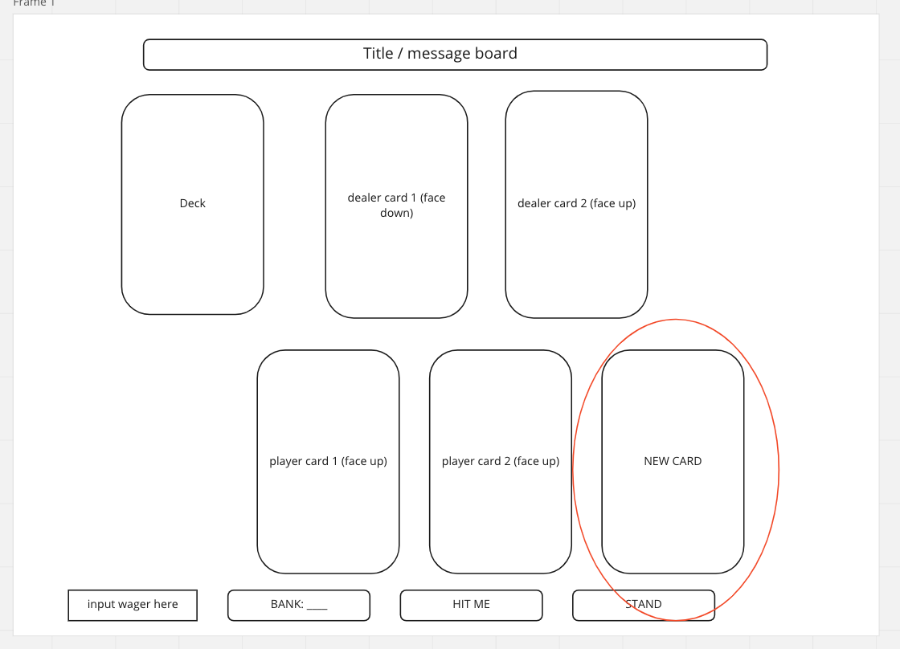

# 														Blackjack

> "Money won is twice as sweet as money earned.” -Fast Eddie Felson, *The Color of Money*

##														  Rules

Blackjack is a betting game played with a 52-card Standard deck; a mainstay at every casino around the world. The object of the game is simple: beat the dealer without your hand value exceeding 21 points. First, a wager is submitted. Then, each player at the table is dealt two cards face up, while the dealer is dealt one card face up, one card face down. In person, the game is played on a table with 7 seats. For this game, we will be working with 1 player vs the dealer. This is a wireframe of the initial game-state:

If a player is dealt a hand with a value of 21 (10, J, Q, or K plus A), they have "Blackjack", and immediately win 1.5x their wager. In turn order, each player decides whether or not they want to add a card to their hand, or "Hit". If a player chooses to "Hit", a new card is dealt to their hand. 

If the hand goes over 21, the player has a "bust" and loses immediately. If the hand is still worth less than 21, the player can choose to "hit" again or "stand". Once each player's turn has ended, the dealer will flip up their face-down card and play their hand in the same fashion. If the dealer has a "bust", everyone who is still in the game wins 2x their wager. If not, Then those who have a hand value higher than the dealer's hand win 2x their wager. If there is a tie, the wager is returned.

##                                                    User Stories

###	Version 1

1. As a user, I want to have a standard 52 card deck to play with.

   - create a 'deck' class whose constructor takes 1 parameter: cards.

   - create a separate class for 'card' which takes 2 parameters: suit and value.

   - create an array of the 4 different suits and store it in a constant.

			suits = [the 4 suits]

   - create an array of the 13 different card values and store it in a constant.
  
			values = [13 card values Ace through King]

   - write a function that will assign all the values a suit and return 1 array of 52 cards. This can be put inside an initialize function:

			newDeck() {
				for each suit, create a new instance of card with each value
			}

	- in the Deck constructor, set the cards parameter to equal the newDeck() function call:

			class Deck {
				constructor(cards) {
					these cards are equal to the newDeck cards
				}
			}

	- deck.cards should now log a deck of 52 cards each value with it's own unique suit.

	- this also allows for the deck to utilize different cards (eg Pinochle rules), although that will not be used in this game.

2. As a user, I want the deck to shuffle before each round.

	- implement the *durstenfeld shuffle algorithm* on the created deck and store this in a class method:

			shuffle() {
				for every card in the deck array in descending order {
					store a random integer value inside a variable and set the index of the card to that value
					re-order the cards by index
				}
			}

	- this will be stored in a variable inside the initialize function that will be called on load, so the game starts with a freshly shuffled deck each round:

			const initialize() {
				create a new instance of Deck stored in a constant
				shuffle the deck using the .shuffle() method
			}

3. As a user, I want the dealer to deal cards to themself and the player.

	- both hands will be stored in arrays: dealerHand and playerHand, declared globally.

	- there will be a class method called dealCards that will simultaneously remove the first index from the deck and push it into the respective hand:

			dealCards() {
				remove the first index from cards.deck
				add that index to playerHand
				remove the first index from cards.deck
				add that index to dealerHand
				etc until both hands have 2 cards stored in their arrays
			}

4. As a user, I want working buttons for my options (hit, stand).

	- these will be hardcoded into the html and stored globally as 'hitButton' and 'standButton' using getElementByID().

	- the hit button will trigger a hit() class method on click:

			on hitButton click {
				hit() {
					remove the first index from cards.deck
					add that index to playerHand
				}
			}

	- we will need two variables declared globally to store the userHandValue and dealerHandValue.

	- because the value key of each card is a string, we will need a globally declared object that reassigns the value to a number for computational purposes. We will call this valueConverter. It will give the numbered cards their face value, the face cards a value of 10, and the Ace a value of 11 (for now).  

	- the value of each hand will be determined by another function: computeHandValue.

			function computeHandValue(hand) {
				the value equals zero
				for each index of hand, value equals itself plus that index
				return the value
			}

	- since the "Ace" card can hold the value of either 11 or 1, the game will need to determine which value is more useful. We will assume that the Ace is always worth 11 unless the hand is over 21, in which case it will be worth 1.

	- the stand button will trigger a compareHands function that will compare playerHandValue to dealerHandValue:

			function compareHands {
				if playerHandValue is greater than dealerHandValue
				update message board to display "You Won!"
			    else update message board to display "The house always wins."
			}

5. As a user, I want to know if I have "Blackjack"

	- once the player's hand is dealt, we will run the computeHandValue function to see if the player was dealt a hand with "BlackJack" or 21 pts.

			computeHandValue() {
				if playerHandValue is strictly equal to 21
				message board will display "BlackJack, you win!"
				bank will equal itself plus 1.5 times the wager
			}

6. As a user, I want to know when I bust.

	- A "bust" occurs when the player "hits" and the value of their hand goes over 21. Because the Ace can have a value of 1 if your hand is over 21, we will need to take this into account when there is a "bust". We can assume that if the player has a hand that contains an "Ace" AND is over 21, they will choose to reassign the "Ace" value to 1, and the game will have to do that for them.

	- We will have a function called checkBust() that will check if the userHand has a value over 21. We will use our computeHandValue function from before. Inside we'll also use a conditional to check if there is an "ace":

			function checkBust {
				compute the value of the user's hand
				IF it is over 21 AND there is an card with value 11 in it
					change the value of that card from 11 to 1
			}

	- checkBust will go inside the event listener associated with the "Hit" button. If a bust occurs, we'll update the innerHTML of the message board to say "BUST".

7. As a user, I want to be able to see how much money I have to play with.

	- we will have a global variable called "bank", initialized to an arbitrary number (let's say 100). This number will be changed in the controller when a wager is submitted and when the user wins a round.

8. As a user, I want to have the ability to submit a wager.

	- we will hardcode a button and textbox into the html.

	- both button and textbox will be stored in global variables.

	- there will be an event listener for a click, which will update a global variable called 'wager' in the controller:

			on submit wager button click {
				wager will equal value typed into textbox
				}

	- in the controller, when the user wins, we will set the bank to equal itself + (wager x2)
		
9. As a user, I want to see the dealer's cards (1 up, 1 down)

	- we will use a div for each card, and the first two cards will be shown when the user presses the "begin" button.

	- the cards will have basic CSS properties that will make them look like rectangles with rounded edges:

			1 pixel solid black border
			border radius of .4rem
			flex
			centered text
			3rem font size

	- all cards will have the same class

	- for now, we will leave the first div devoid of text to represent a face-down card. The second div will contain the text of card.value ("2", "J", "A", etc)

10. As a user, I want to see my cards (2 up).

	- just like with the dealer's cards, we will have two divs hardcoded into the html that will initialize when the cards are dealt

	- with every hit() call, we will add a new div that represents a card dealt from the deck:
				
			create element div
			give it the same class as the other cards
			change div's inner text to card.value
			append div
				
11. As a user, I want the dealer to play their hand.

	- if the player doesn't bust, and the dealer's hand is shown to be less than 17, the dealer needs to hit. This can be another function, called after the player stands.
				
			function playDealerHand {
				show the dealer's face-down card
					if dealerHand is less htan 17
						dealerHand hit()
			}
							
		
###	Version 2

1. I would like the cards to have a Dune theme

2. I want to have the option to double down

3. I want to have the option to split my hand

4. I want the cards to look like real playing cards

5. I would like sounds to play when I win the game
		
6. I would like sounds to play when I lose the game

###	Version 3
		
1. I want to implement a multiplayer option
        